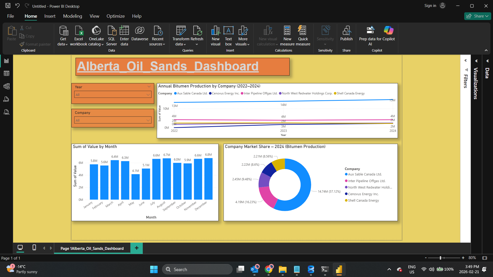

# Alberta Oil Sands Production Analysis
## AER ST39 Data • 2022–2024



**Portfolio project**: Complete ETL pipeline + interactive Power BI dashboard tracking Alberta mineable oil sands production across 9 major operators.

**Built in 1 day** using Python (pandas) → Power BI. Ready for oil & gas data analyst interviews in Calgary.

---

## 🎯 The Business Problem

**Alberta Energy Regulator (AER)** publishes monthly ST39 reports tracking oil sands production, but the raw Excel files are messy and require manual cleaning.

**Recruiters want to see**:
- Real ETL skills (not just "I loaded a Kaggle dataset")
- Domain knowledge (oil sands = Calgary jobs)
- End-to-end delivery (Python → dashboard)

---

## 📊 Key Insights

1. **Gibson Energy grew fastest**: +15.5% YoY (2023→2024)
2. **Seasonal turnarounds**: Sharp April-May dips across all operators
3. **Market leaders**: Suncor, CNRL, Imperial Oil dominate 75%+ share
4. **Data volume**: 12,084 records across 3 years, 9 operators

---

## 🛠️ Tech Stack

| Step | Tool | Input | Output |
|------|------|-------|--------|
| 1 | Python/pandas | 3 messy AER ST39 Excel files | `ab_energy_master.csv` (12K rows) |
| 2 | Power BI | Clean CSV | Interactive dashboard (.pbix) |

---

## 📁 How to Run (2 Minutes)

### Option 1: Use My Files (Easiest)
1. Download `Alberta_Oil_Sands_Dashboard.pbix`
2. Double-click → **Explore immediately** (slicers for Year/Company)

### Option 2: Rebuild From Scratch
```bash
# 1. Download raw AER ST39 data: aer.ca/st39
# 2. Run the notebook
jupyter notebook data_loading_Alberta-energy.ipynb
# 3. Open Power BI → Get Data → ab_energy_master.csv
