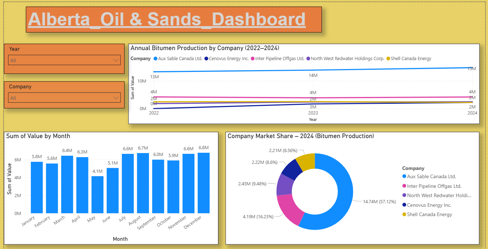

<div align="center">

# Alberta Oil Sands Production Analysis

### Three years of AER filings, nine operators, 251 monthly series — one question: who is actually growing?

An ETL pipeline that reshapes **Alberta Energy Regulator ST39** workbooks into a tidy fact table, and a Power BI model that answers operator- and month-level production questions in seconds.




</div>

---

## The question

The AER publishes ST39 — the statutory record of Alberta oil sands plant activity. It is public, authoritative, and almost unusable: three years means three Excel workbooks, laid out **wide**, with one column per month, merged header rows, unit rows interleaved with data, and commodity streams stacked in blocks rather than typed in a column.

Anyone who wants to answer *"which operator gained ground, and when do turnarounds actually hit?"* is doing it by hand, every time.

**This project turns that filing into a model you can query.**

---

## What it found

| Finding | Detail |
|---|---|
| **Gibson Energy is the cohort's fastest grower** | Crude bitumen production **+15.5% from 2022 to 2024** (15.09M → 17.43M m³) — the largest two-year gain among the five operators reporting bitumen. Growth cooled to **+4.2%** in 2024 alone. |
| **Turnarounds are seasonal and synchronised** | Bitumen output runs **13.2% below the annual mean in May** and **8.4% below in April**, against **+10.6% in December** — the signature of scheduled spring maintenance across the cohort. |
| **Production is concentrated** | **Aux Sable, Syncrude and Gibson hold 74.6%** of reported crude bitumen production over the period. |
| **Shape of the corpus** | 3 annual filings → one **12,084-row** fact table · 9 operators · 36 months · 9 commodity streams · 6 flow types · **251 monthly series** |

---

## Pipeline


```mermaid
flowchart LR
    A["3 × AER ST39<br/>Excel workbooks<br/>2022 · 2023 · 2024<br/><i>wide layout</i>"]
    B["<b>Extract</b><br/>locate real header row<br/>drop merged + unit rows"]
    C["<b>Unpivot</b><br/>wide → long<br/>month columns → rows<br/>commodity blocks → typed column"]
    D["<b>Conform</b><br/>normalise operator names<br/>align schema across years<br/>coerce numerics"]
    E[("ab_energy_master.csv<br/>12,084 rows × 7 cols<br/>Year · Month · Company<br/>Metric_Type · Sub_Type · Value")]
    F["<b>Power BI</b><br/>date + operator dimensions<br/>YoY DAX measures<br/>Year / Company slicers"]

    A --> B --> C --> D --> E --> F
    style C fill:#131E33,stroke:#34D399,color:#E6EDF7
    style E fill:#131E33,stroke:#4F9CF9,color:#E6EDF7
    style F fill:#131E33,stroke:#F2C811,color:#E6EDF7
```

**Step C is the work.** The source is a human-readable report, not a dataset: months run across the page and commodities stack down it. Unpivoting that into `Year · Month · Company · Metric_Type · Sub_Type · Value` is what makes every downstream measure a one-line aggregation instead of a cell-reference puzzle — the same reshape any real enterprise source demands.

---

## The grain

```
Year (2022–24) × Month (12) × Company (9) × Metric_Type (9) × Sub_Type (6) → Value
```

| Dimension | Values |
|---|---|
| **Metric_Type** | Crude Bitumen (m³) · Synthetic Crude Oil (m³) · Diluent Naphtha (m³) · Intermediate Hydrocarbon (m³) · Process Gas (10³m³) · Purchased Natural Gas (10³m³) · Electricity (MWh) · Sulphur (tonnes) · Coke (tonnes) |
| **Sub_Type** | Production · Deliveries · Plant Use · Flared/Wasted · Generated · Purchased |
| **Operators** | Aux Sable · Cenovus · Fort Hills · Gibson · Inter Pipeline Offgas · North West Redwater · Shell Canada · Suncor · Syncrude |

Not every operator reports every stream — 149 of the 251 possible series carry data, and roughly half the rows are structural zeros where a commodity does not apply to a plant. Any measure built on this table filters to the relevant `Metric_Type` and `Sub_Type` rather than summing `Value` across mixed units.

---

## Known limitation

**The fact table has no unique key.** ST39 reports per *plant*; this pipeline keys on *company*, so an operator running more than one plant contributes two to four rows to the same `Year · Month · Company · Metric_Type · Sub_Type` combination — 2,448 of 8,988 keys are affected.

The dashboard aggregates, so operator totals and the findings above are correct. But a measure written against a single row is ambiguous, and that is a modelling defect, not a rounding issue. **The fix is to carry the plant identifier through extraction as a fourth dimension** — see below.

Stating this is deliberate. A pipeline whose limitations are undocumented is a pipeline nobody should trust.

---

## Run it

**Explore the finished model (fastest)**

1. Download `Alberta_Oil_Sands_Dashboard.pbix`
2. Open in Power BI Desktop — slicers for year and operator are live

**Rebuild from source**

```bash
# 1. Pull the raw ST39 workbooks from aer.ca/st39
# 2. Run the pipeline
jupyter notebook "data_loading_Alberta energy.ipynb"
# 3. Power BI → Get Data → ab_energy_master.csv
```

---

## What I would do differently at production scale

- **Carry the plant dimension.** The known limitation above is the first fix: extract the plant identifier so the fact table has a genuine unique grain and per-plant analysis becomes possible.
- **Schedule it.** The notebook is a one-shot build; ST39 lands monthly. This belongs in Azure Data Factory or Airflow with a watermark on the filing date.
- **Make validation a gate, not a glance.** Great Expectations or equivalent, failing the run on schema drift, duplicate keys or unit mismatch rather than producing a quietly wrong dashboard.
- **Version the conformed output.** Partitioned Parquet by year and month instead of one flat CSV, so restating a single month doesn't force a full rebuild.
- **Model the operator dimension properly.** Name normalisation is currently a mapping in code; it belongs in a slowly-changing dimension table that survives a rebrand or an acquisition.
- **Separate structural zeros from missing data.** A zero that means "not applicable to this plant" and a zero that means "not reported" are different facts, and collapsing them hides gaps in the filing.

---

<div align="center">

Built by **[Devesh Ojha](https://github.com/Devesh0508)** · Calgary, AB · [Portfolio](https://devesh0508.github.io)

</div>
